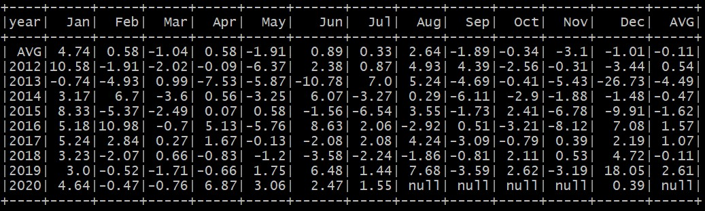

## Fifth homework SPARK
Calculate monthly growth_rate

1. Before usage have to compiler project with maven `mvn clean install`. 
2. After that `cd target`.  
3. And run `scala -J-Xmx2g -classpath 5_Spark-1.0-SNAPSHOT.jar org.example.main`.

Arguments should be located after `org.example.main`  
arguments:  

Options            | Description
:------------------| :---------------------------------------------------
--calculation_mode | can be open-close as "oc" or close-close as "cc"
--calculation_tool | set calculation tool, can be "rdd", "sql" or dataFrame as "dfr"
--load_mode        | set load mode, can be "incr" or full, when we choose "full" will be truncated all audit and stg tables

*Default arguments calculation_mode="oc", calculation_tool = "rdd", load_mode = "incr"*

#### Run Examples
`scala -J-Xmx2g -classpath 5_Spark-1.0-SNAPSHOT.jar org.example.main`   
`scala -J-Xmx2g -classpath 5_Spark-1.0-SNAPSHOT.jar org.example.main --calculation_mode "oc" --calculation_tool "sql"`  
`scala -J-Xmx2g -classpath 5_Spark-1.0-SNAPSHOT.jar org.example.main --calculation_mode "cc" --calculation_tool "dfr"`     

result:  

